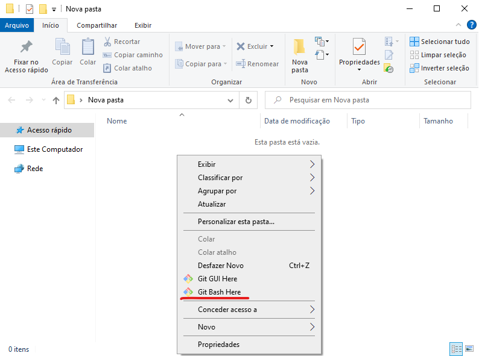
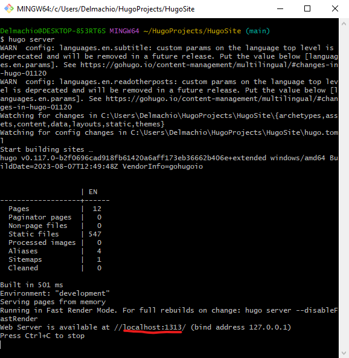
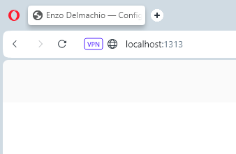

# Hugo Site

Este é um projeto no escopo da aula de Gerência de Configuração. Se trata de um site estático gerado automaticamente pelo framework Hugo.


## Instalação

1. Instale o Git;
2. Instale o Hugo;
3. Instale uma IDE;
4. Crie uma pasta vazia para o projeto;
5. Abra a pasta, clique com o botão direito do mouse e selecione "Git Bash Here";


6. Execute o seguinte comando:
```bash
git clone https://github.com/EnzoDelmachio/EnzoDelmachio.github.io.git
```
7. Execute o seguinte comando:
```bash
cd EnzoDelmachio.github.io
```
8. Execute o seguinte comando:
```bash
hugo server
```
9. Abra o navegador e cole o endereço que apareceu no Git Terminal;

